# DEPLOYMENT

This is where my deployment process will be documented.

## Install Django and packages, Create Django Project, Run Server and allow hosts

Click me

- Install django with *pip3 install django~=4.2.1*
- Install gunicorn with *pip3 install gunicorn ~=20.1*
- Install whitenoise with *pip3 install whitenoise~=6.5.0*
- Install psycopg2 and dj_database_url with *pip3 install dj_database_url~=0.5 psycopg2~=2.9*

- Use command *pip3 freeze --local > requirements.txt* to create requirements.txt and add relavent packages to it.

## Create Django Project 

- Using the command *django-admin startproject elite .* creates our django project at the top level.

## running the server and allowing hosts

Using the command *python3 manage.py runserver* opens the server in port 8000. The server needs allowed hosts in elite-cuisine/settings.py to be added.

## Heroku Deployment

Click me

Navigate to your Heroku dashboard and create a new Heroku app.

Add DISABLE_COLLECTSTATIC with a Value of 1 to stop Heroku uploading static files.

Create a Procfile to allow Heroku to deploy using Gunicorn.

Add Heroku to allowed hosts in elite_cuisine/settings.py.

Connect Heroku to your Github account.

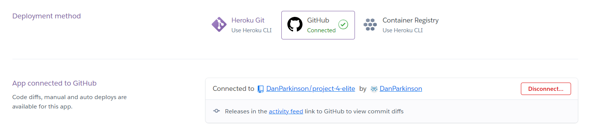

Click deploy branch and wait for completion.

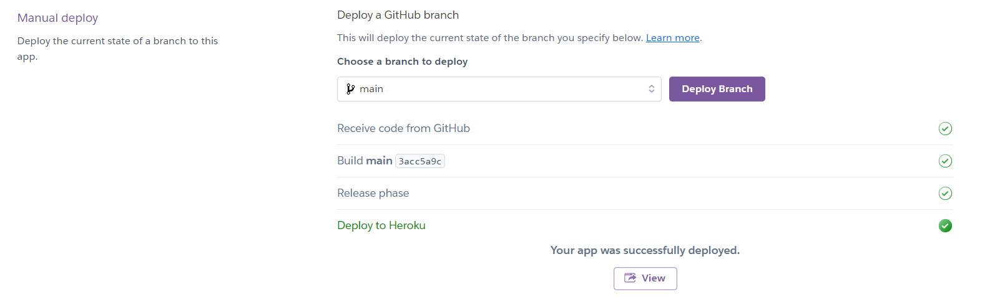

Add Eco Dynos.

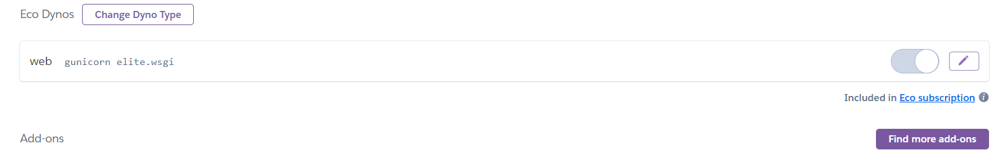

# PostgreSQL database 

Click me

Create an env.py file in the top directory and use this code. The postgreSQL code was generated from Code Institute. It has been redacted from the image.

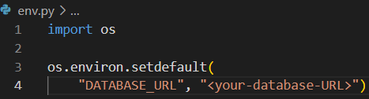

Use the following code to connect the env.py in the elite_cuisine/settings.py.

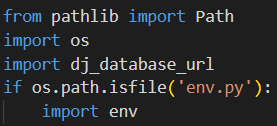

In the elite_cuisine/settings.py file, disconnect the splite database by commenting out the code.

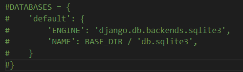

Use dj-databse-url to connect.

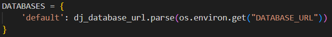

## Create super user

Click me

- Using the terminal command *python3 manage.py migrate*, create a database.
- Create a superuser using djangos built in admin and auth apps using temrinal command python3 manage.py createsuperuser.

## Connect Heroku to the postgreSQL

Click me

- Deploy a new branch in Heroku.

- Create a new convig-var using the name DATABASE-URL and a value of your postgreSQL. This connects Heroku to the postgreSQL.

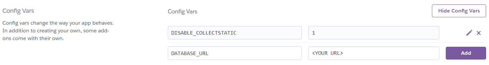

## Secret Key 

Click me

Generate a secret key using letters, numbers and symbols that is hard to guess. This is used to keep information private. Add it to the env.py file with the following code.

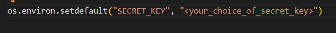

Update the settings.py file.

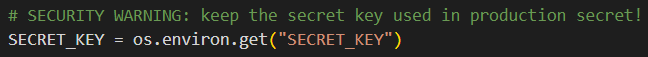

Add secret key as a config-var to Heroku. The name should be SECRET_KEY. The value should be your secret key value.
If done correctly, both local and Heroku deployment should work.

## Deploy Static Files

Click me

Add white noise to middleware. Make sure it is the same location as the photo.

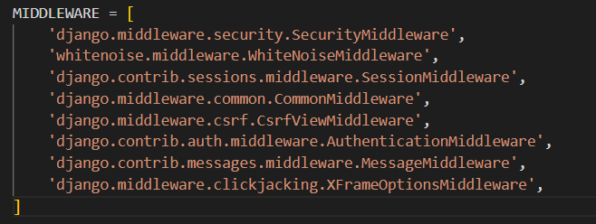

add a static root to elite/settings.py

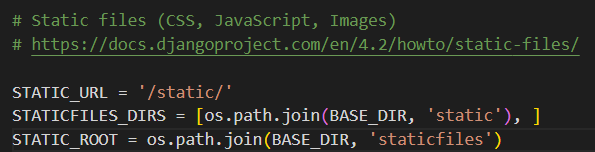

collect static in the terminal.

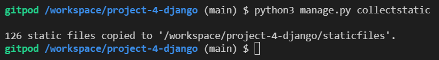

create a runtime.txt file with your version of python IDE. you can get this through the terminal command *python -v*

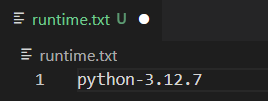

set debug to False.

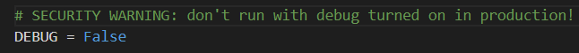

remove the configvar in Heroku of DISABLE_COLLECTSTATIC.

Deploy the site and static files should now load.

set debug back to True.

