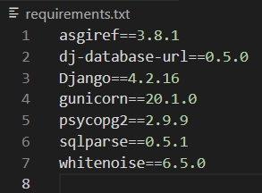
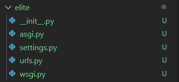
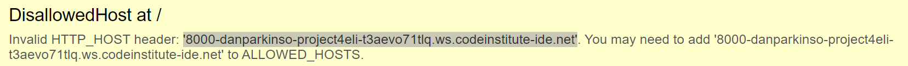
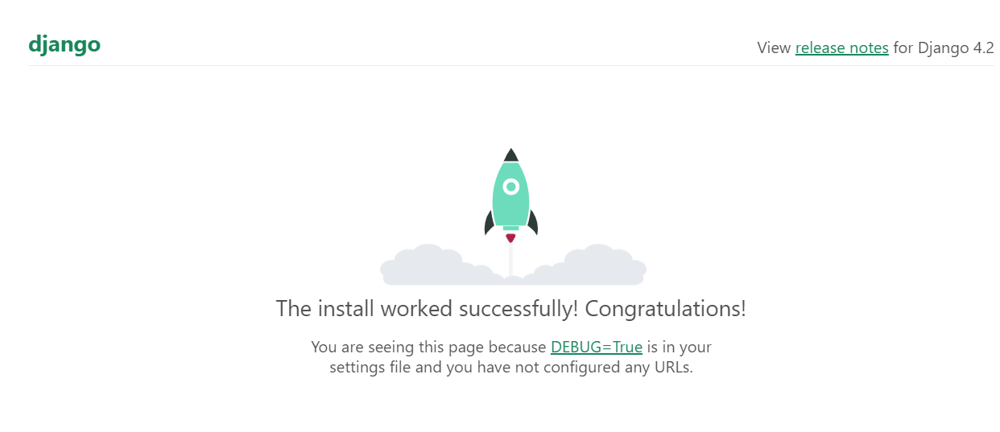
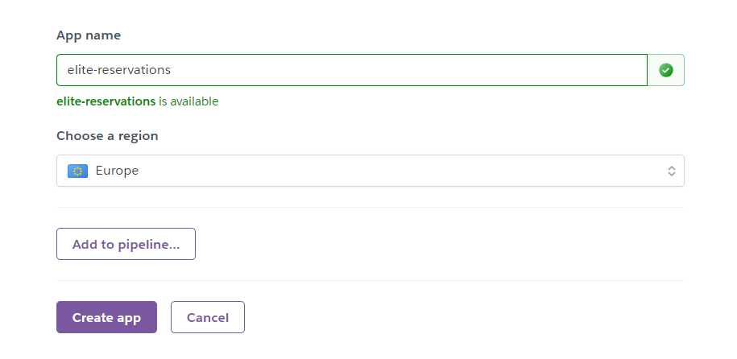
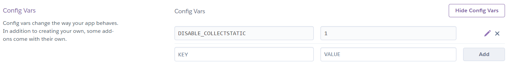
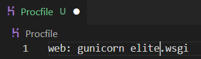
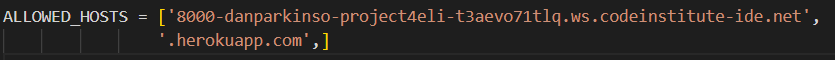

# DEPLOYMENT

This is where my deployment process will be documented.

## Install Django and packages, Create Django Project, Run Server and allow hosts

Click me

- Install django with *pip3 install django~=4.2.1*
- Install gunicorn with *pip3 install gunicorn ~=20.1*
- Install whitenoise with *pip3 install whitenoise~=6.5.0*
- Install psycopg2 and dj_database_url with *pip3 install dj_database_url~=0.5 psycopg2~=2.9*

- Use command *pip3 freeze --local > requirements.txt* to create requirements.txt and add relavent packages to it.

## Create Django Project 

- Using the command *django-admin startproject elite .* creates our django project at the top level.

## running the server and allowing hosts

Using the command *python3 manage.py runserver* opens the server in port 8000. The server needs allowed hosts in elite-cuisine/settings.py to be added.

## Heroku Deployment

Click me

Navigate to your Heroku dashboard and create a new Heroku app.

Add DISABLE_COLLECTSTATIC with a Value of 1 to stop Heroku uploading static files.

Create a Procfile to allow Heroku to deploy using Gunicorn.

Add Heroku to allowed hosts in elite_cuisine/settings.py.

