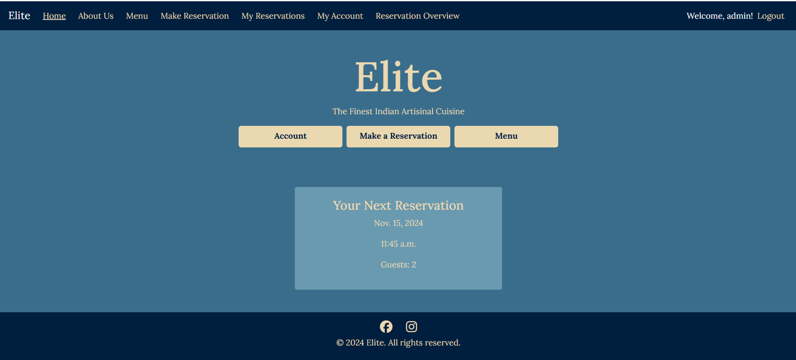

# README

[View The Live Project Here](https://elite-reservations-cd461c878952.herokuapp.com/)

## Table of Contents
1. Introduction
    - Scenario

2. UX
    - User Stories
    - Design Thinking

3. Features
    - Design Features
    - Existing Features
    - Future Adaptations

4. Issues and Bugs

5. Technologies Used
    - Main Languages Used
    - Frameworks, Libraries & Programs Used

6. Testing
    - Testing.md

7. Deployment
    - Deployment.md

8. Credits
    - Content
    - People

9. Acknowledgements

## Introduction

# Elite Cuisine

Welcome to Elite Cuisine. An artisinal Asian brunch restaurant.

### Scenario

Restaurants perform better with a steady stream of customers. These can be walk-ins or pre booked customers. At it's simplest the booking system could be a phone with pen and paper making notes.

Restaurants are busy places. With staff preparing food, waiting tables and providing outstanding customer care. Taking bookings take up a lot of valuable time for service staff. If the phone rings whilst all servers are busy the phone might not be answered. And a ringing phone can ruin the ambience of a restaurant.

It can help the business if customers use an online booking system instead. This dosen't take up valuable staffs time. Bookings could also be made out of working hours, increasing the accessability to the restaraunt, potentially increasing foot traffic and profits. 

A lot of people also prefer a passsive booking system where no human interaction is needed. Meaning a larger clientel.

A business with a well developed website tends to do better than its peers. Customers can gain a better insight of its ethos, facilities and services on offer. In theory this fosters confidence and leads to greater engagement.

With the above in mind, let's create the website!

## UX 

### User Stories

Following an Agile paradigm, user stories will target customer needs and reduce embellishments on the part of the developer. These non technical statements will aid with the incremental changes needed to build the application.

Site user needs can broadly be split into 4 categories or epics:

- Navigation 
- Account Management
- Reservation management
- Other 

#### NAVIGATION

- **As a** user, **I can** follow a link **so that** I can create/logon/logout my account.

- **As an** unregistered user, **I can** navigate to a page **so that** I can view the services offered by the business.

- **As an** unregistered user, **I can** follow a link **so that** I can view the social medias of Elite Cuisine.

- **As an** unregistered user, **I can** use a navigation bar **so that** I can navigate the site on all views.

#### ACCOUNT MANAGEMENT

- **As an** unregistered user, **I can** provide details **so that** I can create an account.

- **As a** registered user, **I can** provide details **so that** I can login to my account.

- **As an** unregistered user, **I can** create a unique password **so that** I can protect my personal account.

- **As a** logged in user, **I can** view a page **so that** I can see my personal account details by individual field.

- **As a** logged in user, **I can** click a button **so that** I can change my personal account details by individual field.

- **As a** logged in user, **I can** click a button **so that** I can delete my account.

- **As a** logged in user, **I can** request an email **so that** I can reset my account password.

#### Reservation MANAGEMENT

- **As a** logged in user, **I can** provide reservation details **so that** I can set up a reservation.

- **As a** logged in user, **I can** update details **so that** I can reschedule my reservation.

- **As a** logged in user, **I can** cancel an reservation **so that** I can cancel a reservation.

- **As a** logged in user, **I can** view a page **so that** I can see my reservations in time order.

- **As an** employee, **I can** view a page **so that** I can see my reservations in order.

Potentially:
- **As a** logged in user, **I can** recieve an email **so that** I can keep track of my reservations.

#### OTHER

- **As a** user, **I can** view the site on a small screen **so that** I can use it when traveling with a mobile device.

- **As an** unregistered user, **I can** view the landing page **so that** I understand the site's purpose.

- **As a** registered user, **I can** leave a review **so that** I can give feedback.

- **As an** admin, **I can** approve reviews **so that** reviews are relevant.

## Design Thinking

[Agile](AGILE.md) use has been documented in a separate file.

Applying a *Design Thinking* approach, what *features* would users find most useful on the developed site?  How feasible is it for an inexperienced student developer to deliver prioritised features given the time constraints of a hard deadline?
As per assessment criteria, this project must utilise CRUD functionality.  This provides a broad outline of what is needed.  A brief though shower offered the following:

| Feature                                     | Importance | Feasibility |
|:--------------------------------------------|:----------:|:-----------:|
| View available services                     | 4          | 5           |
| Create personal account                     | 5          | 5           |
| Update account information                  | 5          | 5           |
| Able to cancel account                      | 5          | 5           |
| Make a reservation                          | 5          | 5           |
| Review latest reservation date/time         | 3          | 4           |
| Able to change/cancel a reservation         | 3          | 4           |
| Send client reservation detail via email    | 2          | 4           |
| Owner has calendar view of reservations     | 4          | 3           |
| **Overall Score**                           | **36**     | **40**      |

The above exercise indicates that overall importance/feasibility scores were similar.  Therefore the project should be deliverable.

### Colour Schema 

I have gone for 

[Colour Schema](docs/readme/colour-schema.png)

 - #001F3F - navbar
 - #3A6D8C - main background
 - #6A9AB0 - card body for contrast
 - #EAD8B1 - text colour

### Database Design 
Entity Relationship Diagrams help to visualise database architecture before creating models in Django.  Understanding the relationships between different tables can save time recoding later in the project.

Entity Relationship Diagram

- After working on the website i thought it wasnt needed to have the calender model. The reservations could just be sorted in their own views. The review model will be implemented in a future update of the website. 

#### Skeleton
Wireframes were made to showcase the appearance of the site pages while keeping a positive user experience in mind. The wireframes were created using a desktop version of [Balsamiq](https://balsamiq.com/).

Balsamiq Wireframes

## Features

Home Page 

Users understand the websites purpose on landing 

Useful buttons clear in center of screen for ease of use 

Buttons change depending if user is logged in

next reservation clear to user for reminder

NavBar

Minimised Navigation

The whole site uses a collapsible menu to save screen real estate on all resolutions.

It occupies the whole screen to encourage the user to make a decision where to navigate to.

Menu options also change depending on whether or not the user is logged in.

To assist user, link elements change style when hovering.

User greeting message for confirmation of login 

Footer 

Fixed Footer

Links are always available at the bottom of the page for all viewscreen sizes.

To assist user, link elements change style when hovering.

About Us 

Information for users if they want more interactivity with the business 

Promotes good community values for improving revenue 

Menu 

Menu page will be populated with a pdf when business needs to update it

information message avaialbe to show as place holder 

Make Reservation 

Form contains all information user needs to make reservation or for staff to contact them 

If reservation requested is unavailable then user will be told nearest possible times available 

My Reservations 

Shows clear list in date/time order of users reservations

buttons linked to each reservation for ease of use 

Also serves as confirmation of reservation 

Edit Reservation 

Prepopulates reservation details (except time) 

Keeps the reservation in tact unless a new reservation is submitted 

available times will appear if selected reservation time is unavailable

Delete Reservation 

Warning message to ensure user knows the risk

My Account 

Shows user account details 

Buttons clear for user interaction

Edit Account Details 

Prepopulated form so user knows their details 

Change Password 

Users need to input their current password for safety 

double password input removes potential mistakes 

Forgotten password button will be applicable in future update

Delete Account 

Warning message to ensure user knows the risk

Admin Reservation Overview 

Table with date picker

Reservations in time order with all applicable fields for ease of use 

make reservation button for if a customer would like to make a reservation over the phone or in person 

Designed for desktop use. NOT FORMATTED FOR MOBILE DEVICES

Register

Standard allauth signup page adapted to the site's theme.

Login 

Standard allauth signup page adapted to the site's theme.

Logout 

Clear buttons for user decision

### Design Features

Users must login for making reservations or accessing their own reservations

Standard users can 

- access home page
- make reservations
- edit their own reservations 
- delete their own reservations 
- view all of their reservations in time order 
- manage their own account details
- register, login, logout 

Super Users can all of the above and

- Access the admin reservation overview page to see all reservations on any given day

### Future Adaptations

- personlaised success messgaes to be even more clear to users
- Users will be able to request a forgottten password code to be able to change it
- Users will be able to leave a review of the site 
- Users will have access to the menu of the restaurant 
- Users will be able to request more information on the about us page 
- A hiring page that is toggleable by admins to advertise job alerts 

- Superusers will be able to confirm reviews
- Superusers will be able to list job advertisements 
- Superusers will be able to upload a pdf of their menu or customise a menu dropdown 

## Issues and Bugs

- edit reservation view not pre populating time but is populating all other information. A few attempts to fix this were attempted but ultimatlet i could not find a solution. The reason I think it is not working is how the data is passed from the database to the form. I attempted to convert it to a tring for the choice field and find the slected information in the time drop down menu to be able to populate it.

- Change password page was flagged as dangerous by Chrome when validating html. Asking student support they chekced the issue and did not recieve the same issue. My mentor also did not expect the issue. Using google I found that when Heroku was a free service, some sites used it for malicious practices. The issue only came up for me when I was validating my password change screen html which may have made Google Chrome overreact. Issue not experienced on other browsers. 

## Technologies Used
### Main Languages Used

- [HTML5](https://en.wikipedia.org/wiki/HTML5 "Link to HTML Wiki")
- [CSS3](https://en.wikipedia.org/wiki/Cascading_Style_Sheets "Link to CSS Wiki")
- [Python](https://en.wikipedia.org/wiki/Python_(programming_language) "Link to Python Wiki")

### Frameworks, Libraries & Programs Used

- [Balsamiq](https://balsamiq.com/) for wireframing
- [Lucidchart](https://lucid.co/) to produce ERD's
- [GitHub](https://github.com/) for repo storage and Agile project management using Kanban boards/issue tracking.
- [Heroku](https://id.heroku.com/) for project deployment to the world wide web.
- [Python3 ](https://docs.python.org/3/) with the following modules
asgiref==3.8.1
dj-database-url==0.5.0
Django==4.2.16
django-allauth==0.57.2
django-phonenumber-field==8.0.0
gunicorn==20.1.0
oauthlib==3.2.2
phonenumbers==8.13.49
psycopg2==2.9.10
PyJWT==2.9.0
python3-openid==3.2.0
requests-oauthlib==2.0.0
sqlparse==0.5.1
whitenoise==6.5.0
- [Bootstrap](https://getbootstrap.com/)
- [JQuery](https://jquery.com/) 
- [Django](https://www.djangoproject.com/)
- [Django Templating](https://docs.djangoproject.com/en/4.0/ref/templates/language/)
- [PostgreSQL](https://www.postgresql.org/)
- [Favicon-Icons](https://favicon.io/favicon-generator/)
- [Allauth](https://django-allauth.readthedocs.io/en/latest/)
- [Chrome DevTools](https://developer.chrome.com/docs/devtools/)
- [W3C Markup Validator](https://validator.w3.org/) HTML linter
- [Jigsaw](https://jigsaw.w3.org/css-validator/) CSS linter
- [JSHint](https://jshint.com/) JS linter
- [PEP8](https://www.pythonchecker.com/) Python linter

## Testing
Refer to [TESTING.md](TESTING.md) for details on manual testing. 
- manual testing.
- No automated testing was performed as the project was rather small.
- Lighthouse site performance checks.
- linter checks on HTML, CSS, JavaScript and Python code.

## Deployment
This process has been documented separately in [DEPLOYMENT.md](DEPLOYMENT.md)

## Credits
### Content
- balsamiq for wireframes 

- DrawSQL for database design 

- bootstrap for easy css styling

- favicons at https://favicon.io/favicon-generator/

- fonts from google fonts https://fonts.google.com/

- Help with time widgets
https://stackoverflow.com/questions/61076688/django-form-dateinput-with-widget-in-update-loosing-the-initial-value

- help with datetime objects 
https://dataheadhunters.com/academy/date-and-time-data-cleaning-techniques-for-standardization-and-parsing/
https://stackoverflow.com/questions/9578906/easiest-way-to-combine-date-and-time-strings-to-single-datetime-object-using-pyt

- bootstrap help
https://hackerthemes.com/bootstrap-cheatsheet/

- Django messages for future implementation
https://ordinarycoders.com/blog/article/django-messages-framework?utm_content=cmp-true

- Colour Schema 
https://colorhunt.co/

The book Python Crash Course by Eric Mattes for help with python. Particularly slices, django forms, dicionary work, sets and bolstering my knowledge of the organisation of my code.

## Acknowledgements

I would like to thank my family for their valued opinions and critic during the process of design and development.
I would like to thank my tutor Excellence, for their invaluable help and guidance throughout the process
