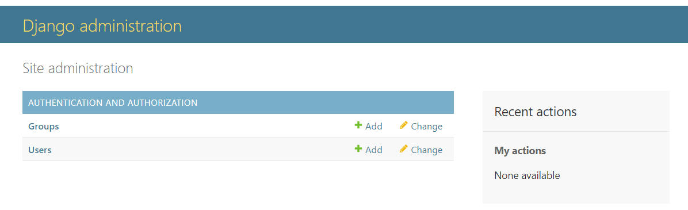

# TESTING

A variety of exploratory tests were performed throughout the project.

## MANUAL TESTING

Getting the live deployed site working. This is well documented in the latter sections of [DEPLOYMENT.md](DEPLOYMENT.md)

## Super User

Click me

When i originally tried to login as a superuser i recieved this error.

After using code institute support i had forgotten to add.

Admin login now functions correctly.

## Creating Templates 

Click me

Create a top level directory to include your templates 

connect the templates directory to *elite/settings.py*

Once the templates partials are populated. The server looks like this

## Connecting CSS and JS

Click me

Connect the static directory to *elite/settings.py*.

Create you style.css as shown at the top level.

Edit base.html to load sytle sheet.

Connect script.js to base.html.

Server with backgorund colour and console message from javascrpit.

