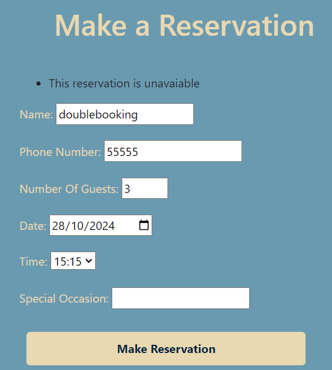

# TESTING

A variety of exploratory tests were performed throughout the project.

## MANUAL TESTING

Getting the live deployed site working. This is well documented in the latter sections of [DEPLOYMENT.md](DEPLOYMENT.md)

## Super User

Click me

When i originally tried to login as a superuser i recieved this error.

After using code institute support i had forgotten to add.

Admin login now functions correctly.

## Creating Templates 

Click me

Create a top level directory to include your templates 

connect the templates directory to *elite/settings.py*

Once the templates partials are populated. The server looks like this

## Connecting CSS and JS

Click me

Connect the static directory to *elite/settings.py*.

Create you style.css as shown at the top level.

Edit base.html to load sytle sheet.

Connect script.js to base.html.

Server with backgorund colour and console message from javascrpit.

## AllAuth

Click me

- Install allauth using *pip3 install django-allauth~=0.57.0*
- Then add to requiremnts using *pip3 freeze --local > requirements.txt*

- Add AllAuth to installed apps.

- Add email confirmation set to none so no errors are thrown.

- Add AllAuth to middleware

- Add site handling.

- Use terminal command shown below to find allauth template files

- Use this command to add them to the directory.

- Templates in directory

- Set debug to False and redlopy on Heroku. Styles now show on AllAuth templates.

## Authentication 

Click me

- Users can create accounts using django allauth and views change.

- Users can log out and views change

- The database stores the user correctly. 

## Account editing

Click me

Tests were performed to check that:
- User name and email are updated in the database
- User password change was used to relogin 
- Deleting accounts removes the user from the database

## Making reservations

Click me

Multiple checks were made for making reservations

- phone number has to be positive number

- number of guests has to be between 1 and 9 

- reservation date has to be today onwards

- time fields are 15 minute intervals

- reservations are saved to the databse

- Users recieve error message when a datetime is selected that is in the past 

## homepage next reservation 

- The home page now shows the next reservation 

## Double Booking 

### With 1 table 

Users can no longer book reservations that are two hours behind or ahead of an already existing reservation

- booked reservation

- Attempt to book 1 hour 45 mins after 

- attempt to book 1 hour 45 minutes before

- attempt to book 2 hours either side succesful

- attempt to book on another day but same time

## Users can see availble times on the day that they book if table in unavailable at their chosen time

- users can now see available times when inputting a reservation that is taken

- Users are now told that there are no available times if fully booked 

- Users booking a reservation today no longer see expired times in available times. current time of picture is 10:27

