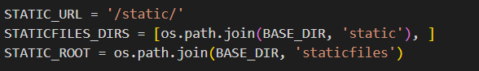
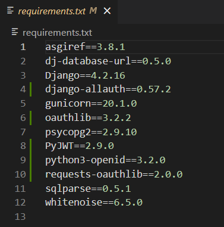
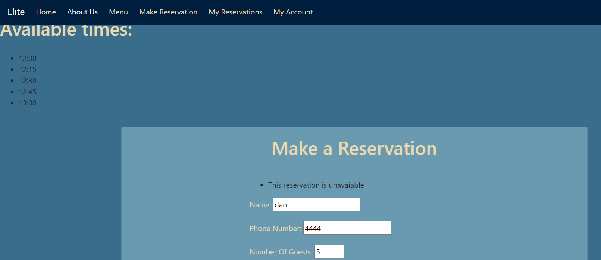
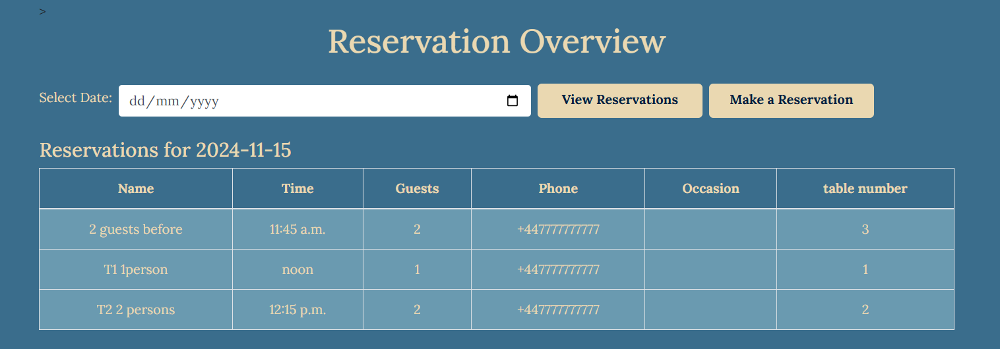
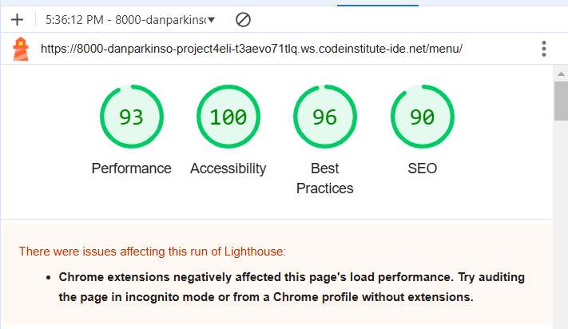

# TESTING

A variety of exploratory tests were performed throughout the project.

## MANUAL TESTING During DEVELOPMENT

Getting the live deployed site working. This is well documented in the latter sections of [DEPLOYMENT.md](DEPLOYMENT.md)

### Super User

Click me

When i originally tried to login as a superuser i recieved this error.

After using code institute support i had forgotten to add.

Admin login now functions correctly.

### Creating Templates 

Click me

Create a top level directory to include your templates 

connect the templates directory to *elite/settings.py*

Once the templates partials are populated. The server looks like this

### Connecting CSS and JS

Click me

Connect the static directory to *elite/settings.py*.

Create you style.css as shown at the top level.

Edit base.html to load sytle sheet.

Connect script.js to base.html.

Server with backgorund colour and console message from javascrpit.

### AllAuth

Click me

- Install allauth using *pip3 install django-allauth~=0.57.0*
- Then add to requiremnts using *pip3 freeze --local > requirements.txt*

- Add AllAuth to installed apps.

- Add email confirmation set to none so no errors are thrown.

- Add AllAuth to middleware

- Add site handling.

- Use terminal command shown below to find allauth template files

- Use this command to add them to the directory.

- Templates in directory

- Set debug to False and redlopy on Heroku. Styles now show on AllAuth templates.

### Authentication 

Click me

- Users can create accounts using django allauth and views change.

- Users can log out and views change

- The database stores the user correctly. 

### Account editing

Click me

Tests were performed to check that:
- User name and email are updated in the database
- User password change was used to relogin 
- Deleting accounts removes the user from the database

### Making reservations

Click me

Multiple checks were made for making reservations

- phone number has to be positive number

- number of guests has to be between 1 and 9 

- reservation date has to be today onwards

- time fields are 15 minute intervals

- reservations are saved to the databse

- Users recieve error message when a datetime is selected that is in the past 

### homepage next reservation 

Click me

- The home page now shows the next reservation 

### Double Booking 

Click me

### With 1 table 

Users can no longer book reservations that are two hours behind or ahead of an already existing reservation

- booked reservation

- Attempt to book 1 hour 45 mins after 

- attempt to book 1 hour 45 minutes before

- attempt to book 2 hours either side succesful

- attempt to book on another day but same time

### Users can see availble times on the day that they book if table in unavailable at their chosen time

- users can now see available times when inputting a reservation that is taken

- Users are now told that there are no available times if fully booked 

- Users booking a reservation today no longer see expired times in available times. current time of picture is 10:27

### my reservations page 

Click me

- users can see all of their reservations that are in the future

- Users can now edit their reservations 
- form prepopulates reservation details when editing except for time

- reservation details can be chnaged
- my reservations updated

- users can now delete reservations 

- my reserations updated

- database deletes and changes the reservations

### staff reservation overview

Click me

- Only staff can see all reservations for a selected day

### Double booking with multiple tables

Click me

There are 8 tables in the restaraunt each with a maximum seating capacity. Tables need to be linked with reservations they can accomodate and ensure that the booking has at least 1 hour to enjoy their reservation. 

For reference 
- table 1 2 guests
- table 2 2 guests 
- table 3 4 guests 
- table 4 4 guests 
- table 5 6 guests 
- table 6 6 guests 
- table 7 8 guests 
- table 8 8 guests 

- both table 1 and 2 can only hold 2 people. Currently they are booked. 

- If a user trys to book with 1 or 2 guests a bigger table capacity will be used.

- If a user books a reservation with 2 guests an hour after a 2 capacity finishes they get assigned the samllest table.

- If a user trys to book a capacity of 8 people tables 7 and 8 will be used.

- If a user trys to book an 8 capacity table when table 7 and 8 are booked they will be given availble times based on their capacity. This proves multiple tests:

- table 7 and 8s bookings are currently staggered. The 11:15 available time is okay for 1 table and not the other so only 1 booking can be made at this time.
- tables 5 and 6 are free which have a capacity of 6 guests. Their available times are not shown as they cannot be seated. 
- There are plenty of times for the day still available but i have sliced them down to the nearest times 3 either side.
- these time are available on other days so the date is checked correctly
- Since there are two tables that can hold this capacity there will be duplicated available time slots e.g. 11:00, 11:00. Only one is shown to not confuse users. 

- 

## AUTOMATED TESTING 

Since the site is relativly small manual testing can cover the testing required. If the site is too grow further I will implement automated testing to ensure all code is checked.

## VALIDATORS 

[W3C Markup Validator](https://validator.w3.org/)

### Not SIGNED IN 

Click me

#### home page

- error with header not being in body tag. extra divs removed.

#### About us 

- no errors 

#### menu page 

- no errors

#### sign up page 

- no errors 

#### Login page 

- missing closing div on form element 

### Signed in 

Click me

#### home page 

- no errors 

#### make reservation

- no errors 

#### edit reservation 

- stray closing div tage removed 

#### delete reservation 

- no errors 

#### my reservations 

- no errors 

#### my account 

- no errors 

#### edit account details 

- no errors 

#### change password 

- buttons with links changed to anchors 

#### delete account 

#### reservation overview 

- closed container div

#### log out 

### CSS VALIDATION

[Jigsaw](https://jigsaw.w3.org/css-validator/)

Click me

- 1 error found with incorrect input. removed it as it contributes nothing

### JS VALIDATION 

[JSHint](https://jshint.com/)

Click me

no custom js was used to no validation needed

### PYTHON VALIDATION 

[PEP8](https://www.pythonchecker.com/)

Click me

- no errors found in any python 

- home views

- profiles views

- reservation forms

- reservation models 

- reservation views 

## Lighthouse 

Click me

- All light house checks passed 

## Browser checks 

- webiste has been checked on chrome, firefox, bing

## Unresolved issues 

- the edit reservations page prepopulates all fields except for the time field 

- During my html validation. The change password page flagged on google chrome as a dangerous site. This did not happen on any other browser. 

- Users cannot request an email to change their passwords.

- users are not sent email confirmation of their reservations or account details changing